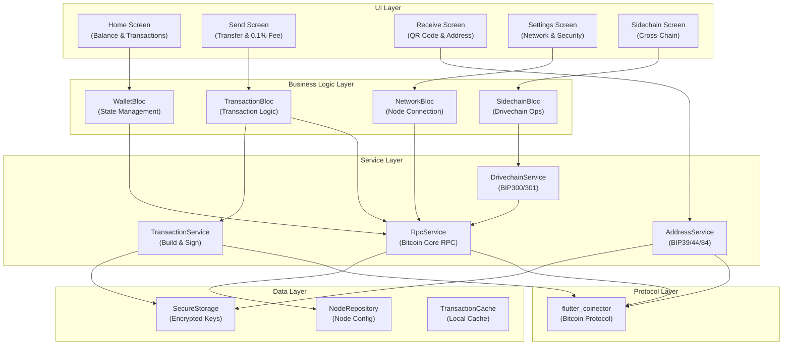
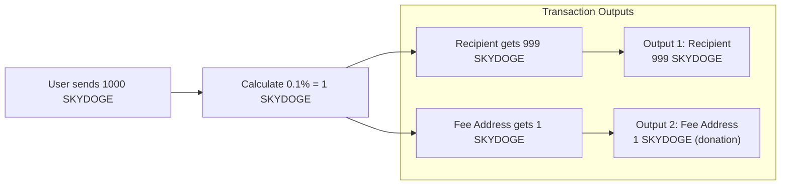

# Skydoge Mobile Wallet Design

Feature Name: skydoge-mobile-wallet
Updated: 2026-03-28
Version: 1.0.2

## Description

Skydoge Mobile Wallet 是一款基于 Flutter 的跨平台移动钱包应用，用于管理 Skydoge (SKYDOGE) 代币。该应用兼容 Bitcoin Core RPC 接口，支持 HD 钱包管理、交易发送、余额查询以及 Drivechain 侧链交互。

## Architecture



## Components and Interfaces

### 1. WalletBloc

Responsibility: 管理钱包状态，包括创建、恢复、锁定/解锁

```dart
abstract class WalletEvent {}
class CreateWallet extends WalletEvent {}
class RecoverWallet extends WalletEvent { final String mnemonic; }
class UnlockWallet extends WalletEvent { final String pin; }
class LockWallet extends WalletEvent {}
class RefreshBalance extends WalletEvent {}

abstract class WalletState {}
class WalletInitial extends WalletState {}
class WalletLoading extends WalletState {}
class WalletLoaded extends WalletState { final Wallet wallet; final int balance; }
class WalletLocked extends WalletState {}
class WalletError extends WalletState { final String message; }
```

### 2. TransactionBloc

Responsibility: 处理交易构建、签名、广播

```dart
abstract class TransactionEvent {}
class BuildTransaction extends TransactionEvent {
  final String toAddress;
  final int amount;
  final int feeRate;
  final bool includeDonation; // 0.1% fee toggle
}
class SignTransaction extends TransactionEvent { final Transaction tx; }
class BroadcastTransaction extends TransactionEvent { final String signedHex; }

abstract class TransactionState {}
class TransactionReady extends TransactionState {}
class TransactionBuilt extends TransactionState { final Transaction tx; final int fee; final int donationFee; }
class TransactionBroadcasted extends TransactionState { final String txid; }
class TransactionError extends TransactionState { final String message; }
```

### 3. RpcService

Responsibility: 与 Skydoge 全节点通信

```dart
class RpcService {
  final String nodeUrl;
  final String authHeader; // Base64 encoded credentials

  Future<int> getBalance(String address);
  Future<List<Transaction>> listTransactions(int count);
  Future<String> sendToAddress(String address, double amount);
  Future<Map<String, dynamic>> getBlockchainInfo();
  Future<String> getSidechainInfo();
  Future<String> simpleDrivechainDeposit(String sidechainId, double amount);
  Future<String> simpleDrivechainWithdraw(String sidechainId, double amount);
}
```

### 4. AddressService

Responsibility: HD 钱包地址生成与管理

```dart
class AddressService {
  // Generate BIP39 mnemonic
  Future<String> generateMnemonic();

  // Derive wallet from mnemonic
  Future<Wallet> deriveWallet(String mnemonic);

  // Get receiving address (BIP84 Bech32)
  Future<String> getReceivingAddress(Wallet wallet, int index);

  // Validate address format
  bool validateAddress(String address);
}
```

### 5. TransactionService

Responsibility: 交易构建与签名

```dart
class TransactionService {
  // Build a transaction with optional 0.1% donation
  Future<Transaction> buildTransaction({
    required String toAddress,
    required int amount,
    required int feeRate,
    required bool includeDonation,
    required String donationAddress,
  });

  // Sign transaction with private key
  Future<String> signTransaction(Transaction tx, List<int> privateKey);

  // Calculate transaction size and fees
  int calculateFee(Transaction tx, int feeRate);
}
```

## Data Models

### Wallet

```dart
class Wallet {
  final String mnemonic;           // Encrypted
  final String seed;               // Derived seed
  final String privateKey;         // Derived private key
  final String publicKey;          // Derived public key
  final String receivingAddress;   // BIP84 Bech32 address
  final int network;               // 0=mainnet, 1=testnet
}
```

### Transaction

```dart
class Transaction {
  final String txid;
  final String hash;
  final int version;
  final List<TxInput> inputs;
  final List<TxOutput> outputs;
  final int locktime;
  final int fee;
  final int donationFee;  // 0.1% of amount if enabled
  final bool isBroadcasted;
}
```

### TxOutput

```dart
class TxOutput {
  final String address;
  final int amount;      // in satoshis
  final bool isDonation; // true if this is the 0.1% fee output
}
```

## 0.1% Donation Fee Implementation



### Fee Calculation

```dart
class DonationCalculator {
  static const String feeAddress = 'SfeeAddressForDonation1234567890abcd';
  static const double donationRate = 0.001; // 0.1%

  static int calculateDonationFee(int amount) {
    return (amount * donationRate).floor();
  }

  static int calculateRecipientAmount(int totalAmount) {
    return totalAmount - calculateDonationFee(totalAmount);
  }
}
```

## Error Handling

| Error Type | Handling Strategy |
|------------|-------------------|
| RPC Connection Failed | Show retry dialog, offer to switch nodes |
| Invalid Address | Show inline validation error |
| Insufficient Balance | Disable send button, show error message |
| Transaction Broadcast Failed | Save to pending transactions, retry automatically |
| Biometric Auth Failed | Fall back to PIN entry |
| Network Switch | Clear cache, reset wallet state |

## Test Strategy

### Unit Tests

- `AddressService`: Mnemonic generation, address derivation, address validation
- `TransactionService`: Fee calculation, donation calculation, transaction building
- `DonationCalculator`: 0.1% calculation accuracy

### Integration Tests

- RPC communication with testnet node
- End-to-end transaction flow (build -> sign -> broadcast)
- Wallet recovery from mnemonic

### Manual Testing

- QR code scanning for address input
- Biometric authentication flow
- Network switching between mainnet/testnet

## Project Structure

```
skydoge_wallet/
├── lib/
│   ├── main.dart
│   ├── app.dart
│   ├── core/
│   │   ├── constants/
│   │   │   ├── network_constants.dart
│   │   │   └── donation_constants.dart
│   │   ├── theme/
│   │   │   └── app_theme.dart
│   │   └── utils/
│   │       └── formatters.dart
│   ├── data/
│   │   ├── models/
│   │   │   ├── wallet.dart
│   │   │   ├── transaction.dart
│   │   │   └── sidechain_info.dart
│   │   └── repositories/
│   │       ├── node_repository.dart
│   │       └── wallet_repository.dart
│   ├── services/
│   │   ├── rpc_service.dart
│   │   ├── address_service.dart
│   │   ├── transaction_service.dart
│   │   ├── drivechain_service.dart
│   │   └── secure_storage_service.dart
│   ├── blocs/
│   │   ├── wallet/
│   │   │   ├── wallet_bloc.dart
│   │   │   ├── wallet_event.dart
│   │   │   └── wallet_state.dart
│   │   ├── transaction/
│   │   │   ├── transaction_bloc.dart
│   │   │   ├── transaction_event.dart
│   │   │   └── transaction_state.dart
│   │   └── network/
│   │       └── network_bloc.dart
│   └── ui/
│       ├── screens/
│       │   ├── home_screen.dart
│       │   ├── send_screen.dart
│       │   ├── receive_screen.dart
│       │   ├── settings_screen.dart
│       │   └── sidechain_screen.dart
│       └── widgets/
│           ├── balance_card.dart
│           ├── transaction_tile.dart
│           ├── address_qr_code.dart
│           └── fee_selector.dart
├── test/
│   └── ...
└── pubspec.yaml
```

## Dependencies

```yaml
dependencies:
  flutter:
    sdk: flutter
  flutter_coinector: ^1.0.0
  bip39: ^1.0.0
  bip32: ^1.0.0
  http: ^1.0.0
  flutter_secure_storage: ^9.0.0
  provider: ^6.0.0
  local_auth: ^2.0.0
  qr_flutter: ^4.0.0
  barcode_scan2: ^2.0.0
  shared_preferences: ^2.0.0
  equatable: ^2.0.0
  intl: ^0.18.0
```

## References

- [Skydoge Official Website](https://skydoge.net)
- [Skydoge Block Explorer](http://explorer.skydoge.net)
- [Skydoge GitHub](https://github.com/skydogenet)
- [Bitcoin Core RPC Docs](/bitcoin/bitcoin)
- [Drivechain BIP 300](https://github.com/bitcoin/bips/blob/master/bip-0300.mediawiki)
- [Drivechain BIP 301](https://github.com/bitcoin/bips/blob/master/bip-0301.mediawiki)

## Changelog

### v1.0.2 (2026-03-28)

**Bug Fix:**
- Fixed WalletWrapper lifecycle issue. The `WalletWrapper` widget was previously a `StatelessWidget` and never dispatched `CheckWalletExistsEvent` upon initialization, causing the `WalletBloc` to remain in `WalletInitial` state indefinitely.
- Changed `WalletWrapper` from `StatelessWidget` to `StatefulWidget` and added `CheckWalletExistsEvent` dispatch in `initState()`.

**New Feature:**
- Added internationalization (i18n) support with English and Simplified Chinese (简体中文) languages.
- Users can switch language in Settings screen.
- All UI text is now localized via `generated/l10n.dart`.

**New Files Added:**
- `lib/l10n/app_en.arb` - English localization strings
- `lib/l10n/app_zh.arb` - Chinese localization strings
- `lib/generated/l10n.dart` - Generated localization delegate
- `lib/core/locale/locale_provider.dart` - Locale management with persistence

**Updated Files:**
- `lib/app.dart` - Added localization delegates and LocaleProvider
- `lib/main.dart` - Added LocaleProvider to widget tree
- `lib/ui/screens/home_screen.dart` - Internationalized UI strings
- `lib/ui/screens/welcome_screen.dart` - Internationalized UI strings
- `lib/ui/screens/settings_screen.dart` - Added language switcher and internationalized strings
- `pubspec.yaml` - Updated version to 1.0.2, added flutter_localizations dependency
