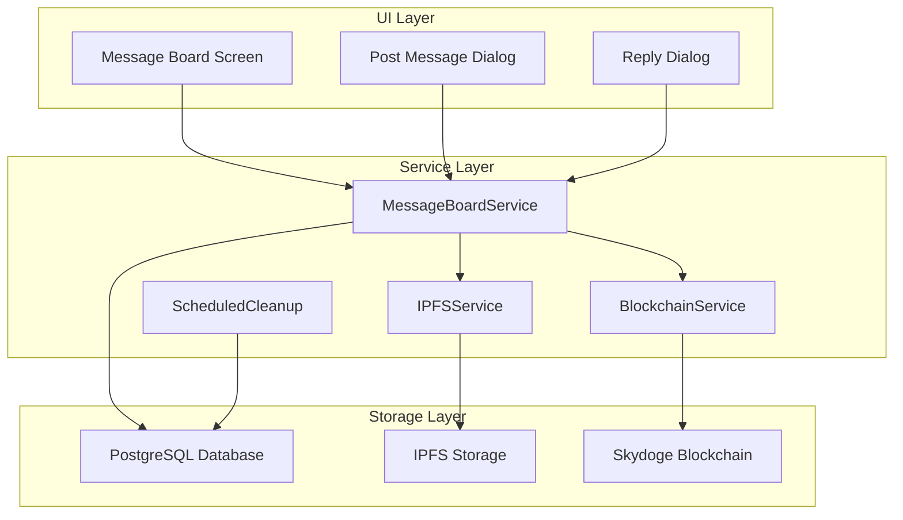
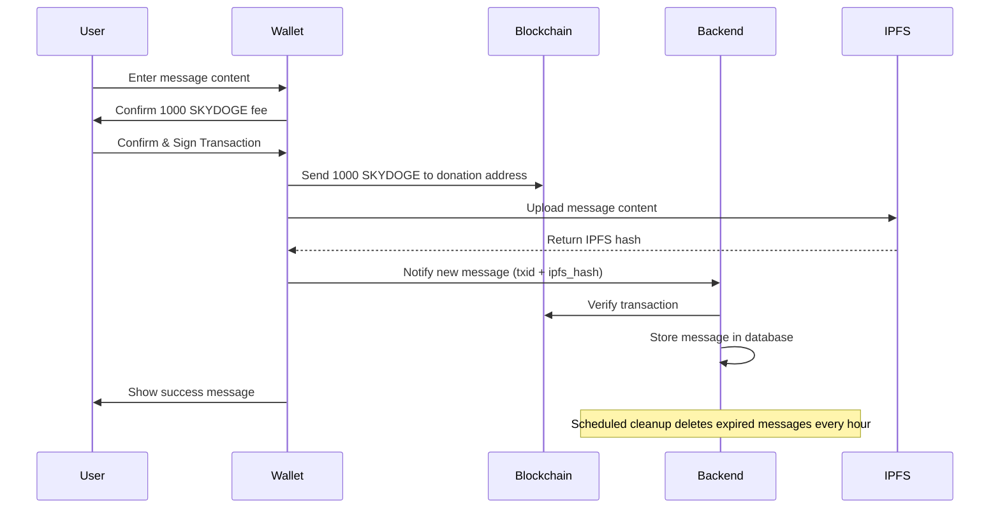

# Message Board Feature Design

Feature Name: skydoge-message-board
Date: 2026-03-28

## Description

A decentralized message board integrated into Skydoge Mobile Wallet. Users can post text messages and replies by paying SKYDOGE. All payments are donated to the Skydoge development fund address.

## Glossary

- **Message**: A text post on the message board
- **Reply**: A response to an existing message
- **Post Fee**: 1000 SKYDOGE to create a new message
- **Reply Fee**: 500 SKYDOGE to reply to a message
- **Retention Period**: 3 days (72 hours) from posting
- **Donation Address**: 1B6PdgGTP7arskB8Abxj7CXp2BaSj83orc
- **OP_RETURN**: Bitcoin/Skydoge protocol feature for embedding metadata in transactions

## Architecture



## Core Features

### 1. Post Message

| Field | Value |
|-------|-------|
| Fee | 1000 SKYDOGE |
| Destination | 1B6PdgGTP7arskB8Abxj7CXp2BaSj83orc |
| Content Type | Plain text only |
| Max Length | 280 characters |
| Retention | 72 hours (3 days) |

### 2. Reply to Message

| Field | Value |
|-------|-------|
| Fee | 500 SKYDOGE |
| Destination | 1B6PdgGTP7arskB8Abxj7CXp2BaSj83orc |
| Content Type | Plain text only |
| Max Length | 280 characters |
| Retention | Until parent message expires |

### 3. Message Display

- Show author address (anonymized: first 6...last 4)
- Show post/reply timestamp
- Show countdown timer (remaining time before deletion)
- Show content
- Auto-refresh list

### 4. Auto-Deletion

- Messages expire after 72 hours
- Expired messages are soft-deleted (removed from display)
- Database cleanup runs every hour

## Data Models

### Message

```dart
class Message {
  final String id;
  final String txid;              // Blockchain transaction ID
  final String authorAddress;      // Poster's wallet address (anonymized)
  final String content;            // Message text (max 280 chars)
  final DateTime createdAt;        // Post timestamp
  final DateTime expiresAt;        // Expiration timestamp (createdAt + 72 hours)
  final bool isReply;              // true if this is a reply
  final String? parentMessageId;   // ID of parent message if reply
  final String ipfsHash;           // IPFS hash for content backup
}
```

### Database Schema

```sql
CREATE TABLE messages (
  id UUID PRIMARY KEY,
  txid VARCHAR(64) UNIQUE NOT NULL,
  author_address VARCHAR(34) NOT NULL,
  content TEXT NOT NULL,
  created_at TIMESTAMP NOT NULL,
  expires_at TIMESTAMP NOT NULL,
  is_reply BOOLEAN DEFAULT FALSE,
  parent_message_id UUID REFERENCES messages(id),
  ipfs_hash VARCHAR(64),
  deleted_at TIMESTAMP,
  created_at_index TIMESTAMP DEFAULT CURRENT_TIMESTAMP
);

CREATE INDEX idx_messages_expires_at ON messages(expires_at);
CREATE INDEX idx_messages_parent ON messages(parent_message_id);
CREATE INDEX idx_messages_created_at ON messages(created_at DESC);
```

## Payment Flow



## API Endpoints

### Backend Service (Node.js/Express)

```
POST   /api/messages              - Create new message
POST   /api/messages/:id/reply    - Reply to message
GET    /api/messages              - List active messages
GET    /api/messages/:id          - Get single message
DELETE /api/messages/:id          - Delete message (owner only)

POST   /api/verify-payment       - Verify blockchain transaction
```

### Request/Response Examples

#### POST /api/messages

Request:
```json
{
  "txid": "abc123...",
  "content": "Hello Skydoge!",
  "ipfsHash": "Qm...",
  "address": "1Abc...1234"
}
```

Response:
```json
{
  "success": true,
  "message": {
    "id": "uuid",
    "txid": "abc123...",
    "content": "Hello Skydoge!",
    "expiresAt": "2026-03-31T12:00:00Z"
  }
}
```

#### GET /api/messages

Response:
```json
{
  "messages": [
    {
      "id": "uuid",
      "authorAddress": "1Abc...1234",
      "content": "Hello Skydoge!",
      "createdAt": "2026-03-28T12:00:00Z",
      "expiresAt": "2026-03-31T12:00:00Z",
      "remainingHours": 72,
      "replyCount": 5
    }
  ]
}
```

## Smart Contract Approach

Since Skydoge is Bitcoin-based (not Ethereum), we use a hybrid approach:

1. **Payment Layer**: Bitcoin/Skydoge blockchain handles payments
2. **Storage Layer**: Off-chain database + IPFS
3. **Verification**: Backend verifies transaction before accepting post

### Payment Verification

The backend verifies:
1. Transaction exists on blockchain
2. Amount is correct (1000 or 500 SKYDOGE)
3. Outputs go to donation address
4. Transaction is confirmed (at least 1 confirmation)

## UI Screens

### Message Board Screen

```
┌─────────────────────────────────┐
│  ← Message Board                │
├─────────────────────────────────┤
│  ⚠️ Messages auto-delete after  │
│     3 days                      │
├─────────────────────────────────┤
│  [Write Message - 1000 SKYDOGE]│
├─────────────────────────────────┤
│  ┌───────────────────────────┐  │
│  │ 1Abc...1234               │  │
│  │ Hello Skydoge!            │  │
│  │ 2 hours ago | 70h left    │  │
│  │ 💬 5 replies              │  │
│  └───────────────────────────┘  │
│  ┌───────────────────────────┐  │
│  │ 1Xyz...5678               │  │
│  │ Great project!            │  │
│  │ 5 hours ago | 67h left    │  │
│  │ 💬 2 replies              │  │
│  └───────────────────────────┘  │
└─────────────────────────────────┘
```

### Post Message Dialog

```
┌─────────────────────────────────┐
│  Write Message            ✕    │
├─────────────────────────────────┤
│  ┌───────────────────────────┐  │
│  │ Enter your message...      │  │
│  │ (max 280 characters)       │  │
│  │                           │  │
│  └───────────────────────────┘  │
│                                 │
│  Fee: 1000 SKYDOGE              │
│  To: 1B6P...j83orc              │
│                                 │
│  ⚠️ Messages deleted after 3 days│
│                                 │
│  [Cancel]    [Post Message]     │
└─────────────────────────────────┘
```

## Security Considerations

1. **Content Validation**: Filter spam, ads, malicious links
2. **Rate Limiting**: Max 10 posts per hour per address
3. **Address Anonymization**: Only show partial addresses
4. **IPFS Backup**: Messages preserved on IPFS for audit

## Implementation Tasks

- [ ] 1. Backend API Service (Node.js/Express)
  - [ ] 1.1 Database setup (PostgreSQL)
  - [ ] 1.2 Message CRUD API endpoints
  - [ ] 1.3 Payment verification service
  - [ ] 1.4 Scheduled cleanup job
  - [ ] 1.5 IPFS integration

- [ ] 2. Frontend Integration (Flutter)
  - [ ] 2.1 Message Board Screen
  - [ ] 2.2 Post Message Dialog
  - [ ] 2.3 Reply Dialog
  - [ ] 2.4 Message Tile Widget
  - [ ] 2.5 Real-time updates

- [ ] 3. Blockchain Integration
  - [ ] 3.1 Detect payment to donation address
  - [ ] 3.2 TX verification service
  - [ ] 3.3 Confirmation waiting

- [ ] 4. Testing
  - [ ] 4.1 Unit tests
  - [ ] 4.2 Integration tests
  - [ ] 4.3 Manual testing

## Dependencies

### Backend
- Node.js 18+
- Express.js
- PostgreSQL
- IPFS (optional for backup)
- Skydoge/Bitcoin RPC client

### Frontend
- Already built Skydoge Wallet

## Cost Analysis

| Action | Amount |
|--------|--------|
| Post Message | 1000 SKYDOGE |
| Reply | 500 SKYDOGE |
| Backend Hosting | ~$5-10/month |
| Database | ~$5-10/month |

Total: ~$10-20/month to run the service
